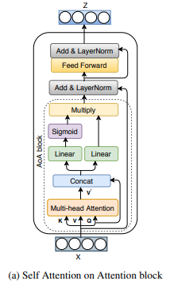

[](https://discord.gg/qUtxnK2NMf)

# Attention on Attention Implementation
This is a practice implementation after randomly finding it on Lucidrain's repo, I'm implementing the model architecture just for practice!

Basically the architecture is:
x => q, k, v -> multihead attn with residual q -> concat -> 2 linear projects
->sigmoid -> mult -> add -> norm -> ffn -> add -> norm with residual of first add and norm

</img>

# Install
`pip3 install `


## Usage

### `AoA` Module
```python

import torch

from aoa.main import AoA

x = torch.randn(1, 10, 512)
model = AoA(512, 8, 64, 0.1)
out = model(x)
print(out.shape)


```

### `AoATransformer`
```python
import torch 
from aoa.main import AoATransformer


x = torch.randint(0, 100, (1, 10))
model = AoATransformer(512, 1, 100)
out = model(x)
print(out.shape)


```


## Citations

```bibtex
@misc{rahman2020improved,
    title   = {An Improved Attention for Visual Question Answering}, 
    author  = {Tanzila Rahman and Shih-Han Chou and Leonid Sigal and Giuseppe Carenini},
    year    = {2020},
    eprint  = {2011.02164},
    archivePrefix = {arXiv},
    primaryClass = {cs.CV}
}
```

```bibtex
@misc{huang2019attention,
    title   = {Attention on Attention for Image Captioning}, 
    author  = {Lun Huang and Wenmin Wang and Jie Chen and Xiao-Yong Wei},
    year    = {2019},
    eprint  = {1908.06954},
    archivePrefix = {arXiv},
    primaryClass = {cs.CV}
}
```

# License
MIT


